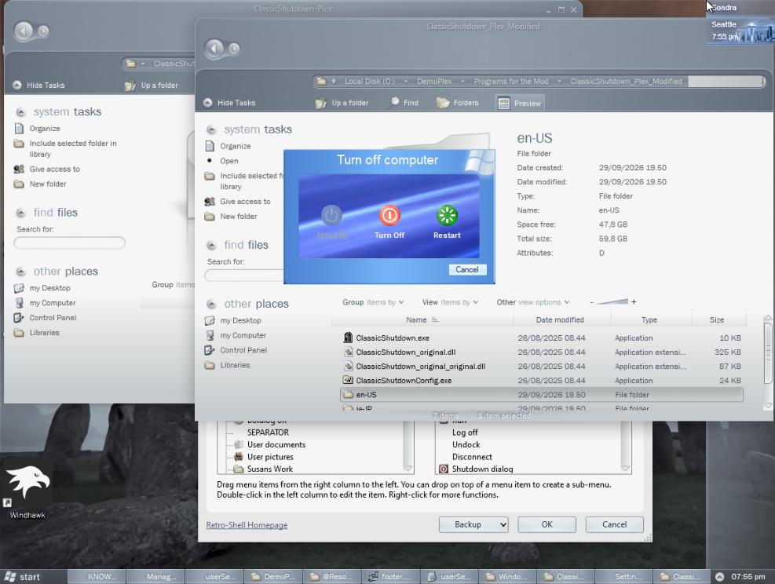
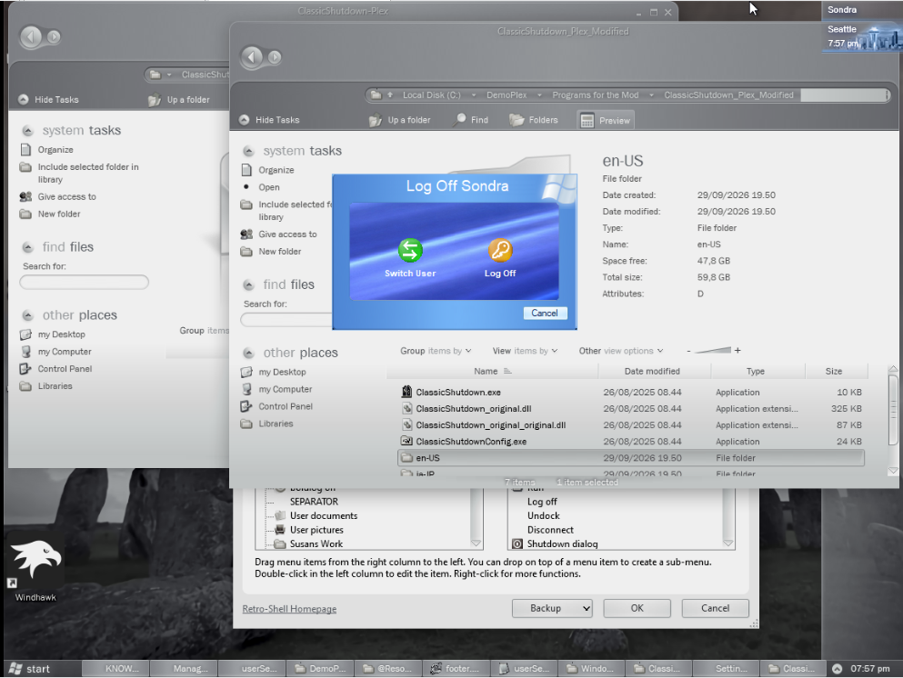

# Classic Shutdown DemoPlex
ClassicShutdown-Plex is a fork of the original Classicshutdown project aim to... Add the LH concept Style

# Why this here?
Because my own personal Windows mod - Project DemoPlex is using the same resource, I would like to post so you guys can edit, try it out without downloading gb(s) full iso image!

## NOTE!!! PLEASE READ(For those who wants to compile this app manually)
- You cannot compile this app since I'm too early to GitHub so changing source is hard for me, I forked the original repo by using resource hacker not visual studio. I'm sorry for your incomvinient
- Only x64 support since I only got an intel laptop, I've never using ARM before and x86 in future release

## Features
- Styles ranging from Windows 95 to Windows Longhorn(except windows xp which not supports)
- Select which options to display
- Custom banner images
- MUI localization
- Longhorn Concept Plex style instead of the boring XP shutdown

## Usage
To display the logoff dialog, pass `/logoff` in the command line arguments. To display the disconnect
dialog, pass `/disconnect` in the command line arguments. To change the shutdown and log off styles,
run `ClassicShutdownConfig.exe`. For extended command line arguments, run `ClassicShutdown.exe /?`.

## API documentation
For API documentation, see the [wiki](https://github.com/aubymori/ClassicShutdown/wiki).

## Screenshots

|  |  |  |
|-|-|-|
|  |  |  |
